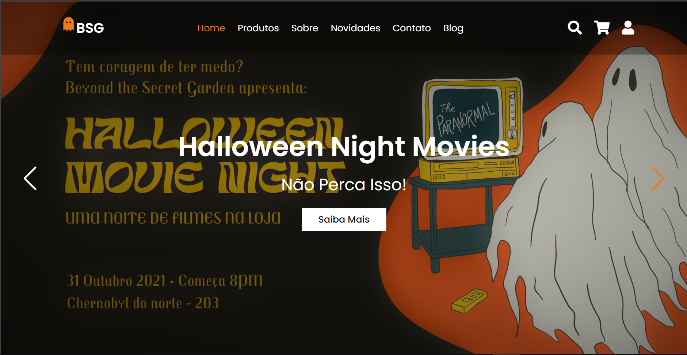

# Halloween-Ecommerce 🎃👻

 

 <a href="#objetivo">Objetivo</a> • 
 <a href="#tecnologias">Tecnologias</a> • 
 <a href="#autora">Autora</a>

<h2 id="objetivo">Objetivo:</h2>

O objetivo com esse site foi criar um e-commerce responsivo e diferente, que celebrasse o Halloween, já que estamos na melhor época do ano e é claro, me divertir com codando. Dediquei muito tempo a este template e a algumas artes originais presentes nele. Todas as artes originais foram realizadas através do Canvas.

<h2 id="tecnologias">Tecnologias:</h2>

Projeto realizado com CSS3, HTML5 e JavaScript (alguns aidionais como jquery e AOS hover)

 

<h2 id="autora">Autora:</h2>

👻 Camila C. R. Santos 🎃 - Frontend Developer

